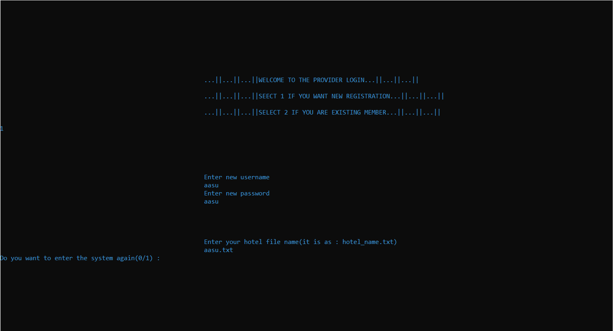

# 🍽️ Food Ordering System (C++)

This is a console-based **Food Ordering System** project written in C++, built specifically to run on **Turbo C++ or Code::Blocks on Windows**.

> 🚨 **Note**: This program uses `conio.h`, `system("cls")`, and `system("color")`, which are **Windows-only** commands. It will **not work on Linux/Mac** without major modifications.

---

## 👨‍🍳 Overview

This software simulates an online food ordering system that supports:

- **Providers** (restaurant owners)
- **Customers** (end-users who order food)

The program allows:
- Provider login & menu management
- Customer login, food ordering, and payment simulation
- File-based data persistence for users and menus
- Multiple food ordering and billing features
- Simulated payment and delivery address entry

---

## 🛠️ Requirements

- ✅ **Windows OS**
- ✅ **Turbo C++** or **Code::Blocks with MinGW**
- ❌ Not compatible with Mac or Linux (due to `<conio.h>` and `system()` commands)

---

## 🧠 Concepts Used

- Class inheritance
- File handling (`fstream`)
- Conditional logic (`switch`, `if`)
- Console formatting (`iomanip`)
- Goto-based flow (for retry/loop logic)
- Use of `system("cls")`, `system("color")` for terminal styling

---

---

## 🎮 How to Run (on Windows)

1. Open the project in **Turbo C++** or **Code::Blocks**.
2. Compile and run `online_food_ordering_system.cpp`.

---

## 🖼️ Screenshots 

👨‍🎓 Author
Name: Aashish Prashad Pandey

Let me know if you want:

- A **refactored version** without `conio.h` so it works on Mac/Linux.
- An updated version with **file structure diagrams** or **flowcharts**.
- A **Makefile or build script** for easier compilation.

